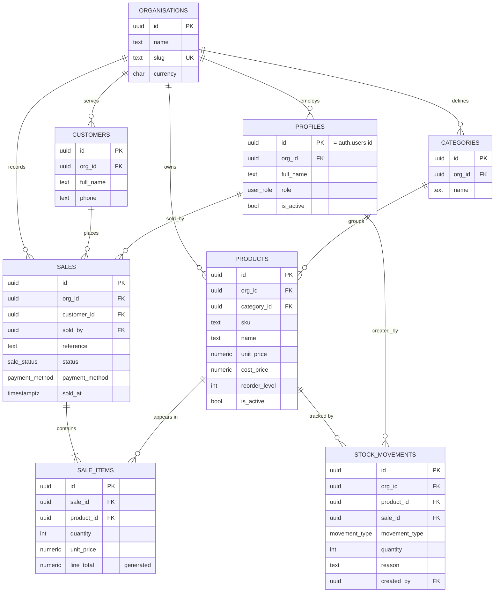

# Product Requirements Document — **Oja**
### A Small Business & Institution Operations System
**Version 1.0 · SIWES Capstone MVP · Benjamin John Abakasanga · Topfaith University**

| Field | Value |
|---|---|
| Product name | Oja (Yoruba: *ọja*, "market") |
| Type | Multi-tenant web application (SaaS) |
| Stack | Next.js 15 (App Router) · TypeScript · Tailwind CSS · Supabase (PostgreSQL + Auth + RLS) · Vercel |
| Status | MVP for academic assessment, built to production standards |
| Author | Benjamin John Abakasanga |
| Reviewers | Industry Supervisor, Institutional Supervisor |

---

## 1. Executive Summary

Small businesses, schools and institutions in Nigeria run their daily operations on three things: a paper ledger, a WhatsApp group, and someone's memory. When the person with the memory is absent, the business stops. Stock goes missing without a trace, the owner cannot say which product actually makes money, and reconciling a day's sales takes an hour of counting notes against scribbles.

**Oja is a single console for the operations of a small organisation: what you hold (inventory), what you sell (sales), who you sell to (customers), who did it (staff and roles), and what it all means (reports).**

It is deliberately *not* an accounting package, an ERP, or a payment processor. It is the thin, fast layer that replaces the paper ledger — the 20% of features that cover 80% of a small organisation's daily record-keeping.

### Why this is the right capstone project
This project was chosen because it exercises all three disciplines of the 4-week programme in a way that is defensible under questioning:

| Programme discipline | Where it lives in Oja |
|---|---|
| **Subnetting & networking** | The deployment environment: a segmented office LAN (VLANs per department, VLSM addressing, controlled egress to the cloud database). Documented in `04_NETWORK_DESIGN.md`. |
| **Database development** | A normalised (3NF) PostgreSQL schema on Supabase with primary/foreign keys, a many-to-many relationship resolved through a junction table, constraints, views, triggers and row-level security. Documented in `03_schema.sql`. |
| **AI-assisted development** | Claude Code and Codex used to plan, generate, debug and review the application, with a written AI usage log and independent verification of every output. Documented in `05_CAPSTONE_DOCUMENTATION.md`. |

---

## 2. Problem Statement

> A small organisation cannot answer, at any moment, three questions: *What do we have? What did we sell? Who did it?*

**Current state (the "as-is"):**
- Stock counts live in a physical notebook, updated inconsistently and never audited.
- Sales are recorded as totals only, so nobody knows *which items* drove the total.
- Prices change over time, so last month's receipts cannot be reconstructed accurately.
- Every staff member sees everything, or nothing; there is no notion of a role.
- Reports are produced by manual addition at month end, if at all.

**Consequences:** stockouts of fast-moving items, dead capital tied up in slow movers, undetectable shrinkage, and decisions made on feel rather than data.

---

## 3. Goals, Non-Goals and Success Metrics

### 3.1 Goals
| ID | Goal |
|---|---|
| G1 | Record a complete sale (multi-item, customer, payment method) in under 30 seconds. |
| G2 | Keep stock levels accurate automatically as a by-product of recording sales — never as a separate chore. |
| G3 | Make every stock change traceable to a person, a time and a reason. |
| G4 | Give the owner a dashboard that answers "how are we doing?" in under five seconds of looking. |
| G5 | Enforce data isolation between organisations at the database layer, not the application layer. |
| G6 | Ship an interface whose quality signals trust — the kind of product a user would pay for. |

### 3.2 Non-Goals (explicitly out of scope for the MVP)
- Payment processing / payment gateway integration.
- Full double-entry accounting, tax filing, or payroll.
- Offline-first operation and background sync.
- Native mobile applications.
- Barcode scanner hardware integration (the SKU field is designed to accept scanner input later).
- Multi-currency, multi-branch, or multi-warehouse operations.

> **Defence note:** being able to state what you *deliberately did not build*, and why, is a stronger signal of engineering judgement than a long feature list. Scope control is a deliverable.

### 3.3 Success Metrics
| Metric | Target |
|---|---|
| Time to record a 3-item sale | < 30 s |
| Dashboard first meaningful paint | < 1.5 s on a 3G-equivalent connection |
| Stock accuracy after a demo of 10 sales | 100% (system stock == expected stock) |
| Cross-organisation data leakage in testing | 0 rows (verified by RLS test) |
| Lighthouse Accessibility score | ≥ 95 |

---

## 4. Users and Personas

| Persona | Role in system | Needs | Pains |
|---|---|---|---|
| **Adaeze** — shop owner / school bursar | `owner` | Sees everything; wants the numbers | Cannot trust the numbers she has |
| **Tunde** — supervisor / storekeeper | `manager` | Manages products, receives stock, views reports | Stock book never matches the shelf |
| **Grace** — sales attendant / front desk | `staff` | Records sales fast, looks up prices | Slow, error-prone paper receipts |

### 4.1 Core User Stories
1. As a **staff member**, I can record a sale of several products in one transaction so that stock and revenue update together.
2. As a **staff member**, I am prevented from selling more units than are in stock, so the records stay truthful.
3. As a **manager**, I can add a product with a SKU, price, cost and reorder level so that low stock is flagged automatically.
4. As a **manager**, I can receive new stock and state a reason, so that every increase is explained.
5. As an **owner**, I can see today's revenue, item count, low-stock items and top sellers on one screen.
6. As an **owner**, I can invite a staff member and set their role, so that access matches responsibility.
7. As any **user**, I can only ever see data belonging to my own organisation.

---

## 5. Scope — MVP Feature Set

### 5.1 Module map
```
Oja
├── Authentication & Organisation   (sign in, org creation, invite, roles)
├── Dashboard                       (KPIs, today's activity, low stock, top sellers)
├── Inventory                       (products, categories, stock receipts, adjustments, movement history)
├── Sales                           (new sale, sales register, sale detail, void)
├── Customers                       (directory, purchase history)
├── Staff                           (member list, role assignment, deactivation)
├── Reports                         (revenue over time, product performance, stock valuation)
└── Settings                        (organisation profile, currency, low-stock threshold)
```

### 5.2 Functional requirements

#### FR-1 · Authentication & Organisation
| ID | Requirement | Acceptance criteria |
|---|---|---|
| FR-1.1 | Email/password sign-up and sign-in via Supabase Auth | A new user can register and is returned to the dashboard authenticated |
| FR-1.2 | Google OAuth as an optional alternative provider | If enabled, the Google button completes sign-in and creates the same profile shape |
| FR-1.3 | On first sign-in a user either creates an organisation or joins one by invite | A user cannot reach the app shell without an `org_id` on their profile |
| FR-1.4 | Every user has exactly one role: `owner`, `manager`, `staff` | Role is stored on `profiles.role` and enforced by RLS policy and UI |
| FR-1.5 | Sign-out clears the session everywhere | Protected routes redirect to `/sign-in` |

#### FR-2 · Dashboard
| ID | Requirement | Acceptance criteria |
|---|---|---|
| FR-2.1 | Four KPI tiles: Revenue today, Sales today, Items sold today, Low-stock count | Values match a manual SQL count of the same period |
| FR-2.2 | 14-day revenue sparkline/bar chart | Chart reads from `v_daily_sales` |
| FR-2.3 | Top 5 products by revenue (last 30 days) | Matches the reference query in `03_schema.sql` §Queries |
| FR-2.4 | Low-stock list with one-click "Receive stock" | Items where `stock <= reorder_level` |
| FR-2.5 | Empty states for a brand-new organisation | No blank screens; each panel explains the next action |

#### FR-3 · Inventory
| ID | Requirement | Acceptance criteria |
|---|---|---|
| FR-3.1 | Create/edit/deactivate a product (name, SKU, category, unit price, cost price, reorder level) | SKU is unique *within an organisation* |
| FR-3.2 | Products are never hard-deleted, only deactivated | `is_active = false`; historical sales remain intact |
| FR-3.3 | Current stock is **derived** from stock movements, not stored on the product | `v_product_stock` returns the same number as a hand-calculation |
| FR-3.4 | Receive stock: quantity + reason → creates an `in` movement | Stock increases by exactly that quantity |
| FR-3.5 | Adjustment: signed quantity + mandatory reason (damage, count correction, theft) | Movement recorded with `created_by` and timestamp |
| FR-3.6 | Movement history per product, newest first | Shows type, quantity, reason, user, time |
| FR-3.7 | Category management | A category cannot be deleted while products reference it |

#### FR-4 · Sales
| ID | Requirement | Acceptance criteria |
|---|---|---|
| FR-4.1 | Build a sale from a searchable product picker, multiple line items | Line total = quantity × unit price, computed by the database |
| FR-4.2 | Optional customer attachment; optional walk-in | `customer_id` nullable |
| FR-4.3 | Payment method: cash, transfer, card, credit | Stored as an enum |
| FR-4.4 | Completing a sale automatically deducts stock | Trigger writes one `out` movement per line item |
| FR-4.5 | Overselling is blocked at the database level | Attempting to sell more than available raises an exception and the whole transaction rolls back |
| FR-4.6 | Human-readable sale reference, unique per organisation | e.g. `SA-2026-0041` |
| FR-4.7 | A sale can be voided by a manager/owner; stock is restored | Status becomes `void`, compensating `in` movements are written — nothing is deleted |
| FR-4.8 | Price is snapshotted onto the line item at sale time | Changing a product's price later does not alter historical sales |

#### FR-5 · Customers
| ID | Requirement | Acceptance criteria |
|---|---|---|
| FR-5.1 | Create/edit customer (name, phone, email, address) | Phone unique per organisation when provided |
| FR-5.2 | Customer detail shows lifetime spend and full purchase history | Values match the reference aggregate query |

#### FR-6 · Staff & Roles
| ID | Requirement | Acceptance criteria |
|---|---|---|
| FR-6.1 | Owner can change roles and deactivate members | Non-owners cannot reach the staff page |
| FR-6.2 | Role capability matrix enforced in both UI and RLS | See §9.2 |

#### FR-7 · Reports
| ID | Requirement | Acceptance criteria |
|---|---|---|
| FR-7.1 | Revenue by day/week/month with date-range filter | Driven by SQL aggregation, not client-side loops |
| FR-7.2 | Product performance: units sold, revenue, gross margin | Margin = revenue − (units × cost price) |
| FR-7.3 | Stock valuation: Σ (stock × cost price) | Single figure plus per-category breakdown |
| FR-7.4 | Export current view to CSV | File downloads with correct headers |

---

## 6. Data Model

Full DDL, constraints, views, triggers, policies, seed data and reference queries live in **`03_schema.sql`**. Summary here; normalisation argument in §6.3.

### 6.1 Entity Relationship Diagram



### 6.2 Key design decisions (memorise these — they are exam questions)

| Decision | Reason |
|---|---|
| **UUID surrogate primary keys** | Generated client- or server-side without a round trip, safe to expose in URLs, and no collision when merging data. Trade-off: larger index than `BIGSERIAL`, non-sequential inserts. |
| **`sale_items` junction table** | A sale contains many products and a product appears in many sales — a many-to-many relationship. Relational databases cannot store M:N directly, so it is resolved into two one-to-many relationships through a junction (bridge) table that carries its own attributes: `quantity` and `unit_price`. |
| **`unit_price` copied onto `sale_items`** | This is *not* redundancy. `products.unit_price` is the **current** price; `sale_items.unit_price` is the **historical fact** of what was charged at that moment. They are semantically different attributes that happen to share a value at the time of sale. |
| **`line_total` as a generated column** | Derived within the same row by the database, so it can never drift out of sync with `quantity × unit_price`. Stored for query speed. |
| **Stock derived from `stock_movements`** | A single `stock_quantity` column can be corrupted by a failed update and explains nothing. A movement ledger is append-only, auditable ("who removed 4 units and why?"), and stock is the sum of the ledger. Trade-off: a `SUM()` per read, mitigated by an index on `(product_id)` and, at scale, a materialised view. |
| **`org_id` on every tenant table** | Enables a single, simple row-level security predicate per table and an index that makes every tenant query selective. |
| **Soft deletes (`is_active`)** | Referential integrity with historical sales must never be broken by a deletion. |
| **`role` as an enum, not a lookup table** | A closed, stable domain of three values. Using a `roles` table would also satisfy 3NF and would be the correct choice if roles became data the customer edits; today it would add a join to every authorisation check for no benefit. *(State the trade-off, not just the choice.)* |

### 6.3 Normalisation walkthrough (1NF → 3NF)

Start from the unnormalised paper receipt:

```
RECEIPT(receipt_no, date, customer_name, customer_phone, staff_name,
        items[(product_name, category, qty, price)], total)
```

- **1NF — atomic values, no repeating groups.** `items[...]` is a repeating group inside one row. Split it out into `SALE_ITEMS`, one row per line, each with a single product. Every column now holds one indivisible value.
- **2NF — no partial dependency on part of a composite key.** In `SALE_ITEMS` the candidate key is `(sale_id, product_id)`. `product_name` and `category` depend only on `product_id`, i.e. on *part* of the key — a partial dependency. Move them to `PRODUCTS`, leaving only `quantity` and `unit_price`, which genuinely depend on the whole key.
- **3NF — no transitive dependency on non-key attributes.** In `PRODUCTS`, `category_name` depends on `category_id`, which depends on `product_id`: a transitive dependency (`product_id → category_id → category_name`). Move category names into `CATEGORIES` and keep only the `category_id` foreign key. Likewise `customer_name`/`customer_phone` move out of the sale into `CUSTOMERS`.

**Result:** every non-key attribute depends on the key, the whole key, and nothing but the key.

**Where the design deliberately stops:** `sale_items.unit_price` and the derived `line_total` look like denormalisation to an untrained eye. `unit_price` is a temporal fact, not a copy; `line_total` is a generated column maintained by the engine. Neither can become inconsistent, which is the actual harm normalisation exists to prevent.

---

## 7. Technical Architecture

```
┌────────────────────────────────────────────────────────────────┐
│ Office LAN (see 04_NETWORK_DESIGN.md)                          │
│  VLAN 10 Sales/POS · VLAN 20 Admin · VLAN 30 Inventory         │
│  VLAN 40 Servers   · VLAN 50 Guest · VLAN 99 Management        │
│                    │                                           │
│              L3 switch ── Firewall/Router ── NAT ── ISP        │
└────────────────────┼───────────────────────────────────────────┘
                     │ HTTPS/TCP 443 only (egress policy)
        ┌────────────▼──────────────┐     ┌──────────────────────┐
        │ Vercel Edge (Next.js 15)  │────▶│ Supabase             │
        │  · React Server Components│     │  · PostgreSQL 15     │
        │  · Server Actions         │     │  · Auth (JWT)        │
        │  · Route handlers         │     │  · Row-Level Security│
        └───────────────────────────┘     │  · Storage (later)   │
                                          └──────────────────────┘
```

### 7.1 Stack and rationale
| Layer | Choice | Why |
|---|---|---|
| Framework | Next.js 15, App Router, TypeScript | Server Components keep data access on the server; Server Actions remove the need to hand-write an API layer for an MVP |
| Styling | Tailwind CSS v4 + CSS custom properties | Design tokens expressed once, used everywhere (§8) |
| Database | Supabase PostgreSQL | Managed Postgres with auth, RLS and a SQL editor — full SQL, no ORM lock-in |
| Auth | Supabase Auth (email+password; Google OAuth optional) | JWT carries `auth.uid()`, which RLS policies read directly |
| Data access | `@supabase/ssr` server client | Cookie-based session, safe in Server Components |
| Charts | Recharts | Small, declarative, no canvas complexity |
| Validation | Zod | One schema validates form input on both client and server |
| Hosting | Vercel | Zero-config Next.js deployment, preview URLs for the demo |

### 7.2 Repository structure
```
oja/
├─ app/
│  ├─ (auth)/sign-in/ , sign-up/
│  ├─ (app)/
│  │  ├─ layout.tsx            # shell: sidebar + topbar
│  │  ├─ page.tsx              # dashboard
│  │  ├─ inventory/
│  │  ├─ sales/ , sales/new/ , sales/[id]/
│  │  ├─ customers/
│  │  ├─ staff/
│  │  ├─ reports/
│  │  └─ settings/
│  └─ layout.tsx , globals.css
├─ components/
│  ├─ ui/                      # primitives: Button, Input, Card, Table, Dialog, Badge
│  └─ app/                     # composed: KpiTile, ProductPicker, SaleLineEditor
├─ lib/
│  ├─ supabase/server.ts , client.ts
│  ├─ queries/                 # one file per domain, typed
│  ├─ actions/                 # server actions (mutations)
│  └─ validation/              # Zod schemas
├─ supabase/migrations/        # 03_schema.sql split into ordered migrations
├─ types/database.types.ts     # generated by supabase gen types
└─ docs/                       # the documentation deliverables
```

### 7.3 Data-access rules
1. **No `service_role` key in application code, ever.** It bypasses RLS. It exists only for local administrative scripts.
2. Reads happen in Server Components through the SSR client; the user's JWT travels with the query and RLS filters rows.
3. Mutations happen in Server Actions: validate with Zod → call Supabase → `revalidatePath`.
4. Multi-step mutations run inside a Postgres function so they are atomic (a sale either completes fully or not at all).

---

## 8. Design System — "Quiet Instrument"

### 8.1 Research basis
The look is derived from how premium software companies present dense operational data. Apple's Human Interface Guidelines rest on three long-stated principles — Clarity (legible, precise, easy to understand), Deference (the UI serves the content and never competes with it), and Depth (layers and motion convey hierarchy), with consistency as the connective tissue. In practice that means legible text at every size, precise and lucid icons, subtle and appropriate adornments, content filling the screen while the UI stays out of the way, and minimal use of bezels, gradients and shadows to keep the interface light. Apple's own scale anchors body text at 17pt and large titles at 34pt, sets a minimum touch target of 44×44pt, and uses 16–20pt margins with 8/16/24pt content spacing.

The same restraint shows up in the design languages people cite as the current benchmark for premium product UI — Stripe and Apple for luxury-minimal, Linear and Vercel for dark-premium precision, Notion for warm editorial calm. What those systems share is not a colour palette; it is **discipline**: one typeface family, a strict spacing scale, hairline borders instead of drop shadows, a single accent colour reserved for the primary action, and motion measured in 150–200 ms.

**What "AI slop" looks like, and what Oja does instead:**

| AI slop | Oja |
|---|---|
| Purple→blue gradient hero on white | Warm paper canvas, ink text, one deep-green accent |
| Inter / Roboto everywhere | Instrument Serif display + Geist UI + JetBrains Mono numerals |
| Heavy card drop-shadows stacked three deep | 1px hairline borders; elevation reserved for popovers and dialogs only |
| Emoji as icons | A single consistent line-icon set at 1.5px stroke |
| Every element animated | Motion only on state change, 160 ms, transform/opacity only |
| Centred marketing layout for an app screen | Left-aligned dense grid; numbers right-aligned and tabular |

### 8.2 Tokens

```css
:root {
  /* Canvas & surface */
  --canvas:        #FBFAF8;   /* warm paper, not pure white */
  --surface:       #FFFFFF;
  --surface-sunk:  #F4F2EE;

  /* Ink */
  --ink:           #16150F;   /* near-black, warm */
  --ink-muted:     #6C6A60;
  --ink-faint:     #9B988D;

  /* Lines */
  --hairline:      #E7E4DC;
  --hairline-strong:#D6D2C7;

  /* Accent — used ONLY for the primary action and active nav */
  --accent:        #1B4D3E;
  --accent-hover:  #163F33;
  --accent-soft:   #E8F0EC;

  /* Semantic */
  --positive:      #2F6F4E;
  --warning:       #9A6B12;
  --danger:        #A23B36;

  /* Radius */
  --r-sm: 6px; --r-md: 10px; --r-lg: 14px; --r-pill: 999px;

  /* Elevation (used sparingly) */
  --e-popover: 0 8px 24px -8px rgb(22 21 15 / 0.14), 0 2px 6px -2px rgb(22 21 15 / 0.08);

  /* Motion */
  --dur: 160ms; --ease: cubic-bezier(0.2, 0, 0, 1);
}
```

**Spacing scale (4px base):** 4 · 8 · 12 · 16 · 24 · 32 · 48 · 64. Nothing in between.

**Type scale:**
| Token | Family | Size / line-height | Use |
|---|---|---|---|
| `display` | Instrument Serif | 34/40, regular | Page titles, KPI figures |
| `title` | Geist | 20/28, 560 | Section headers |
| `body` | Geist | 15/22, 400 | Everything |
| `label` | Geist | 13/18, 500, +0.01em | Form labels, table headers (uppercase optional) |
| `caption` | Geist | 12/16, 400 | Helper text, timestamps |
| `numeric` | JetBrains Mono | 14/20, `font-variant-numeric: tabular-nums` | Money, quantities, all table figures |

> **The one detail people remember:** every monetary figure in Oja is set in tabular monospace and right-aligned, so columns of naira line up to the decimal. It is the difference between a spreadsheet and a toy.

### 8.3 Component rules
- **Button:** height 36px (44px on touch), `--r-sm`, primary = solid `--accent` with white text; secondary = `--surface` with hairline border; destructive = text `--danger`, solid only on confirmation dialogs. One primary action per screen.
- **Input:** 36px, hairline border, 1px `--accent` ring on focus (never remove the focus ring), label above, error text below in `--danger`.
- **Card:** `--surface`, hairline border, `--r-md`, 20px padding, no shadow.
- **Table:** 44px rows, hairline row separators, sticky header, text left / numbers right, empty state inside the table body.
- **Badge:** pill, `--accent-soft`/`--surface-sunk` background, 12px label.
- **Dialog:** centred, max 480px, `--e-popover`, backdrop `rgb(22 21 15 / 0.32)`, 160 ms fade + 2px rise.
- **Nav:** 240px left sidebar, active item = `--accent-soft` background with `--accent` text, no icons-only mode in the MVP.

### 8.4 Accessibility
- All text meets WCAG AA (≥4.5:1); `--ink` on `--canvas` is ~16:1.
- Every interactive element is keyboard reachable with a visible focus ring.
- Forms use real `<label for>`; errors are announced via `aria-live="polite"`.
- Colour is never the sole carrier of meaning (low stock = amber badge **and** the word "Low").
- Respect `prefers-reduced-motion`.

### 8.5 Key screens
| Screen | Above-the-fold content |
|---|---|
| Dashboard | 4 KPI tiles → 14-day revenue chart → two columns: Low stock / Top sellers |
| New sale | Left: product search + line editor. Right: sticky summary card with total and Complete button |
| Inventory | Filter bar (search, category, "low stock only") → dense table → row click opens detail drawer |
| Sale detail | Reference, status badge, customer, line items table, totals block, Void action for managers |
| Reports | Date range control → three stacked report cards, each with a CSV export |

---

## 9. Security

### 9.1 Principles
1. **Authorisation at the data layer.** Even a compromised client cannot read another organisation's rows, because the policy runs inside PostgreSQL.
2. **Least privilege.** Anonymous key in the browser; `service_role` never leaves local scripts.
3. **Defence in depth.** UI hides what a role cannot do; RLS makes it impossible anyway.
4. **Server-side validation.** Zod schemas re-validate every input in the Server Action; client validation is a convenience, not a control.
5. **Auditability.** Stock movements and sales are append-only and carry `created_by` + timestamp.

### 9.2 Role capability matrix
| Capability | owner | manager | staff |
|---|:--:|:--:|:--:|
| Record a sale | ✅ | ✅ | ✅ |
| View own sales | ✅ | ✅ | ✅ |
| View all sales | ✅ | ✅ | ❌ |
| Void a sale | ✅ | ✅ | ❌ |
| Create/edit products | ✅ | ✅ | ❌ |
| Receive stock / adjust | ✅ | ✅ | ❌ |
| Manage customers | ✅ | ✅ | ✅ |
| View reports | ✅ | ✅ | ❌ |
| Manage staff & roles | ✅ | ❌ | ❌ |
| Edit organisation settings | ✅ | ❌ | ❌ |

### 9.3 Threat notes
| Threat | Control |
|---|---|
| Tenant data leakage | RLS `org_id = current_org_id()` on every table; junction tables filtered via their parent |
| Privilege escalation via profile update | `profiles.role` is not writable by the row's owner; only an `owner` policy may update it |
| Overselling / negative stock | Database trigger raises an exception; transaction rolls back |
| SQL injection | Parameterised queries via the Supabase client; no string-concatenated SQL |
| Secret leakage | Only `NEXT_PUBLIC_SUPABASE_URL` and the anon key reach the browser; `.env.local` is gitignored |

---

## 10. Build Plan — Final Week (5 working days)

| Day | Target | Done when |
|---|---|---|
| **Mon** | Repo, Supabase project, run `03_schema.sql`, seed data, auth + app shell | You can sign in and see an empty dashboard styled with the tokens |
| **Tue** | Inventory module end-to-end (products, categories, receive, movements) | You can add a product and receive 20 units, and stock reads 20 |
| **Wed** | Sales module end-to-end (new sale, register, detail, void) | Selling 3 units drops stock to 17; selling 100 is refused |
| **Thu** | Dashboard, reports, customers, staff, polish pass against §8 | Every screen has an empty state and a focus ring |
| **Fri** | Deploy to Vercel, capture screenshots, finish documentation, rehearse twice | The demo runs start-to-finish on the deployed URL without a stumble |

**Cut list if time runs short** (in this order): CSV export → stock valuation report → customer detail history → staff invitations (create members directly in Supabase instead). **Never cut:** RLS, the overselling guard, the dashboard.

---

## 11. Risks

| Risk | Impact | Mitigation |
|---|---|---|
| Live demo fails on venue Wi-Fi | High | Record a 3-minute screen capture as a fallback; also run `npm run dev` locally against the same database |
| RLS blocks your own queries during development | Medium | Test policies in the Supabase SQL editor with `set local role`; keep a checklist of policies per table |
| AI generates code you cannot explain | **Critical — this is the assessed risk** | Rule: nothing is committed until you can restate what it does line by line. Log every prompt (see §12) |
| Scope creep (payments, barcode, mobile app) | High | §3.2 non-goals are frozen |
| Time zone / date bugs in "today's revenue" | Medium | Store `timestamptz`, aggregate with `date_trunc('day', sold_at AT TIME ZONE 'Africa/Lagos')` |

---

## 12. AI-Assisted Development Protocol

Every AI interaction on this project is logged in `05_CAPSTONE_DOCUMENTATION.md` §6 with four columns: **Stage · Prompt (summarised) · Output · How I verified it.**

The verification rule, in order:
1. **Read it.** If a line is unfamiliar, ask the assistant to explain that line, then confirm against official documentation.
2. **Run it.** Behaviour in the browser, not confidence in the chat, is the evidence.
3. **Break it.** Feed the edge case (zero quantity, missing customer, oversell, wrong role) and confirm it fails safely.
4. **Check the source.** API names, Postgres functions and library options are verified against docs — assistants confidently invent plausible ones.

---

## 13. Glossary

| Term | Meaning |
|---|---|
| Multi-tenant | One deployment serving many organisations whose data is isolated |
| RLS | Row-Level Security — PostgreSQL filtering rows per user by policy |
| Junction table | A table resolving a many-to-many relationship (`sale_items`) |
| Derived value | A value computed from stored data rather than stored (current stock) |
| Snapshot value | A value stored deliberately to preserve a historical fact (`sale_items.unit_price`) |
| Server Action | A Next.js server-side function callable from a component, used for mutations |
| VLSM | Variable Length Subnet Masking — different mask lengths per subnet to reduce address waste |

---

## 14. Sign-off

| Role | Name | Signature / Date |
|---|---|---|
| Intern | Benjamin John Abakasanga | |
| Industry Supervisor | | |
| Institutional Supervisor | | |
